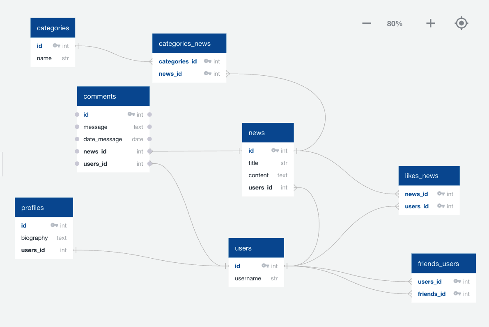

### users
-----
- id int pk
- username str 

### profiles
------
- id int pk
- biography text
- users_id int FK - users.id

### friends_users
------
- users_id int pk fk >- users.id
- friends_id int pk fk >- users.id

###  news
-----
- id int pk
- title str
- content text
- users_id int fk >- users.id

###  likes_news
------
- news_id int pk fk >- news.id
- users_id int pk fk >- users.id

### categories
--------
- id int pk
- name str

### categories_news
------
- categories_id int pk fk >- categories.id
- news_id int pk fk >- news.id

### comments
--------
- id int pk
- message text
- date_message date
- news_id int fk >- news.id
- users_id int fk >- users.id

